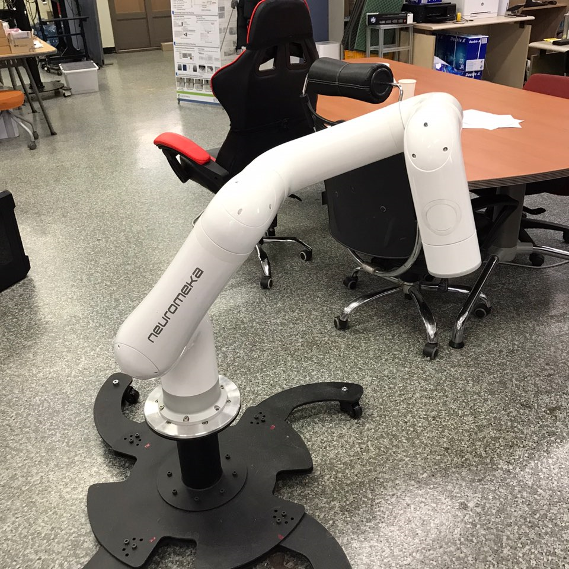

Neuromeca Indy7 Manual
======================

.. raw:: html

    

.. warning::
   **로봇을 사용하기 전에 반드시 아래의 점검 항목을 확인하세요.**
   
   1. **Encoder Battery**

      - **로봇에 불이 안 들어온 상대로 두면 엔코더가 방전된다.**
      - Emergency button을 “계속” 눌러 놓으면 전원이 꺼지고 엔코더가 방전된다.
      - 엔코더가 방전되면 A/S요청해서 수리해야 함.
   2. **Emergency**

      - **개발 된 제어 알고리즘을 시뮬레이션 환경에서 검증 후, 실제로봇에 적용**
      - **비상스위치는 항상 옆에 두고 할 것** (시뮬레이션 검증했더라도 실제에서 발산 가능)

.. toctree::
   :maxdepth: 2
   :caption: Contents

   documents
   overview
   as_manual
   user_comments

