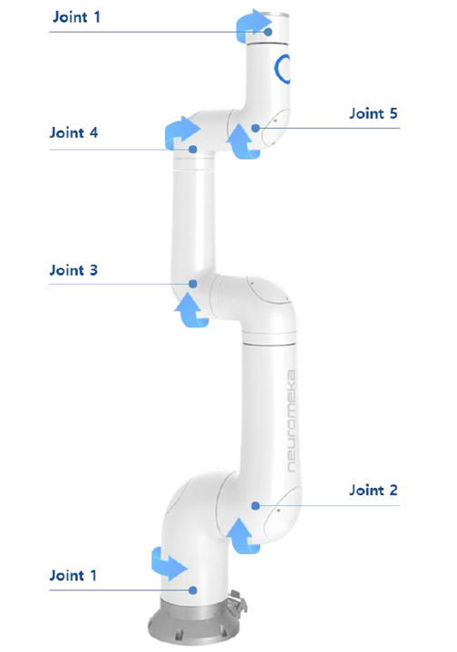
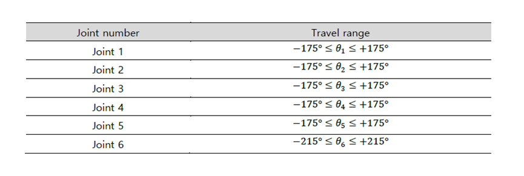
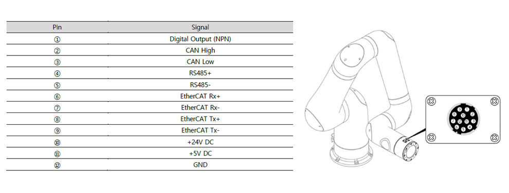
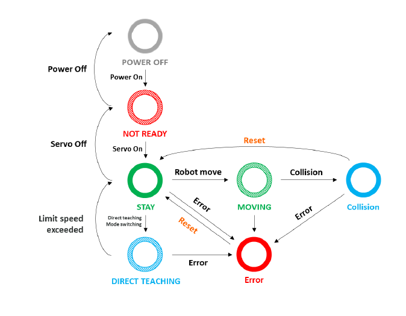
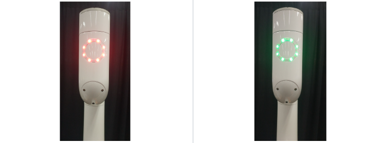
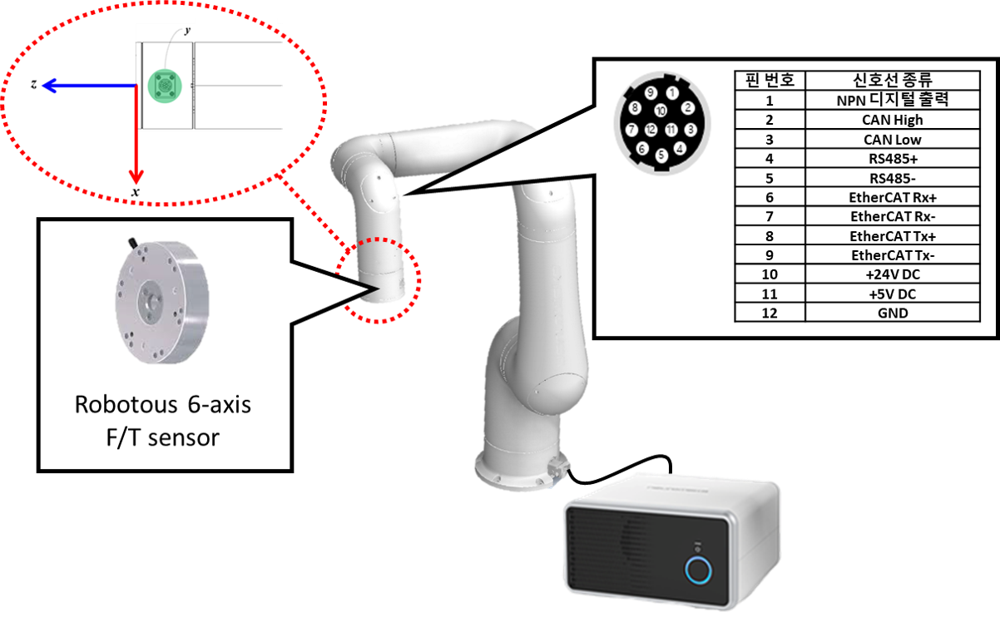
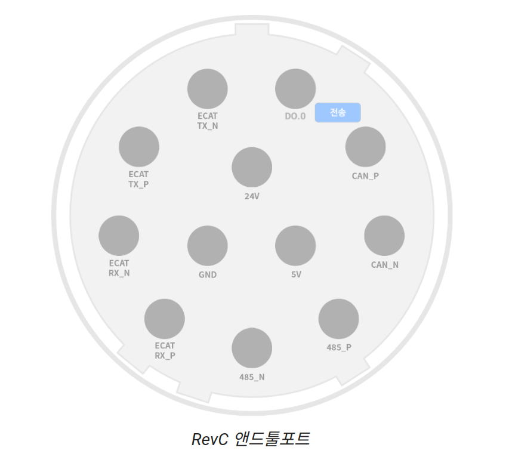

Overview
=========

Robot Arm (Indy7)
-----------------

- A six DOF (all revolute) collaborative robot
- The maximum allowable payload is 7kg
- Joint coordinates and range
    - the direction indicated by the arrow is positive rotation, i.e. positive angle, and the opposite direction is negative rotation.

   Joint 1~6

- To avoid self-collision and internal cable disconnection, all joints have a restricted range of motion.

   Joint range

- The end tool port has a 24V DC and 5V DC power supply, as well as CAN, serial, and EtherCAT communication interfaces.

   End tool port signal line

- The fifth link has an end tool indicator, which alerts the robot operator about the robot's state or operating mode.
    - Each mode is represented by three colors and two actions, such as lighting-on and flashing (indicated as a stripe color in the figure below)

   LED mode guide

   Not ready (left), Stay (right)

End-Tool Configuration
----------------------
1. **Origin** ⇒ The connector direction is +Y direction. And the origin point is the center of the end-plane.
2. 탭홀은 M4 규격
3. 신호선 커넥터 규격
    1. SN-10-12(R) = Robot-side
    2. **SN-10-12(P) = Cable-side**

   http://docs.neuromeka.com/2.3.0/kr/IndySDK/section_inertia_reshaping/

Control Box
-----------
- The control box supplies power to the robot, calculates and transmits all control signals required for robot operation, and processes all input and output signals via electrical connections to peripherals.

- Power On
    - Press the power button on the control box front panel.

    .. figure:: overview/cb_power_on.png
        :alt: Control box power on
        :width: 500px
        :align: center

    - When power is turned on normally, the power indicator on the control box front panel turns blue.

    .. figure:: overview/cb_front_rare.png
        :alt: Control box front and rear
        :width: 500px
        :align: center

Teaching Pendant (Old Version)
------------------------------

- Open the app and connect to the robot IP.

.. list-table::
   :widths: 33 33 33
   :align: center

   * - .. image:: overview/teach_pendant_1.png
          :alt: Teach pendant 1
          :width: 220px
     - .. image:: overview/teach_pendant_2.png
          :alt: Teach pendant 2
          :width: 220px
     - .. image:: overview/teach_pendant_3.png
          :alt: Teach pendant 3
          :width: 220px

- Conty 프로그램에서 로봇에 접속하려면 먼저 로봇이 켜진 상태(불이 들어온 상태)여야 하고, Conty에서는 Wi-Fi Connect를 선택하고 IP를 입력하면 된다.

End-Tool Port
-------------

